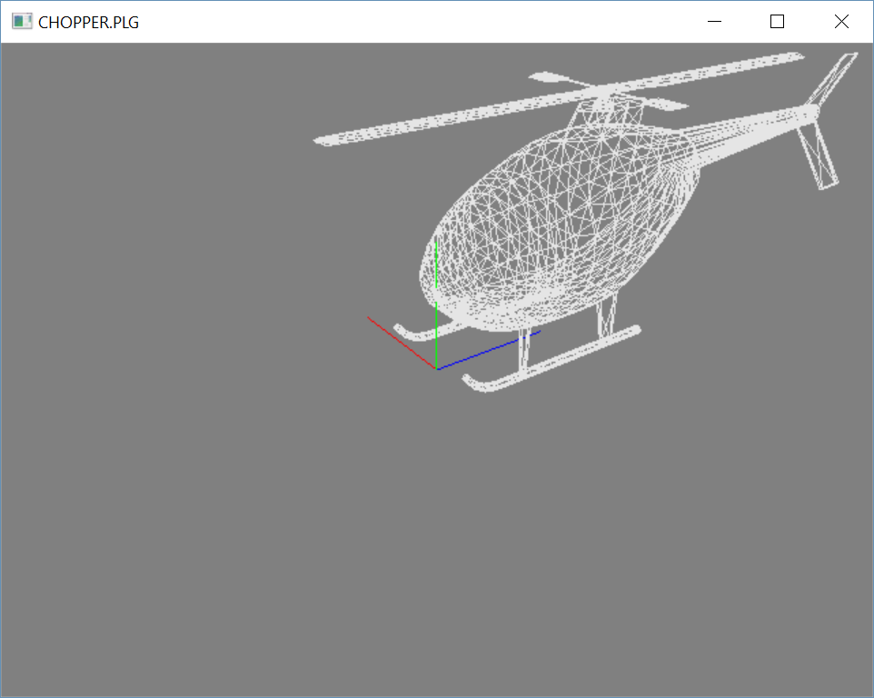

# PLG format viewer in Freeglut



Plg format viewer.

## Running

```
plg.exe file.plg
```
##PLG format desciption and demo files from Thanassis Tsiodras (Hawk/Enigma)

Say for example that you have just one triangle forming the "scene", 
with these coordinates:

  Point 1:   10, 10, 10
  Point 2:   -10,10, 60
  Point 3:  110, 0, -10

Then the .plg file representing this "object" would be this:

Line 1:
object_name 3 1
            | |
            | +--- This is the number of polygons in the scene
            +----- This is the number of vertexes (points) in the scene.

Lines 2-4:   The coordinates of all the points in the scene
10 10 10
-10 10 60
110 0 -10

Line 5:            The polygons. The first number is 1 (I don't know what
                   this is used for, but I keet it for compatibility).
                   The next number is the number of points this specific
                   polygon has (in our example, 3, since it's a triangle).
                   This version only allows 3 and 4 point polygons.
                   The following numbers are the indexes in the vertexes
                   already given (i.e. this polygon is formed by vertexes
                   x,y,z,...) The numbers following should be as many
                   as specified (in our example, 3). Note that the first
                   vertex (point) is vertex 0, not vertex 1.
1 3 0 1 2

After defining an object, you can define another one, in the same way:

obj1 3 1
10 10 10
-10 10 60
110 0 -10
1 3 0 1 2
object2 2100 310
...
..
object3 10 20
...

etc.


## Help

Movement with left mouse button, zoom with right mouse button, 
l - light ON/OFF, w - wireframe/solid